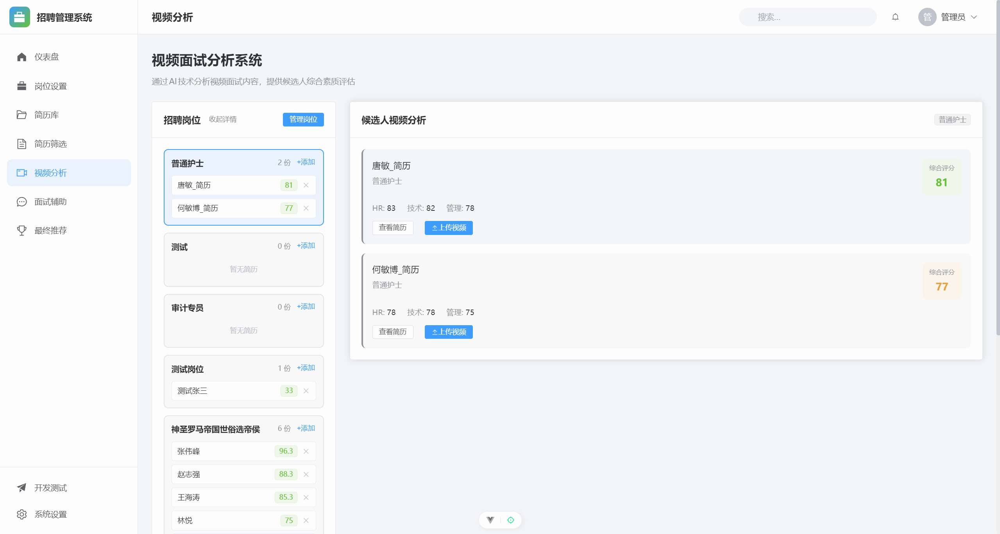
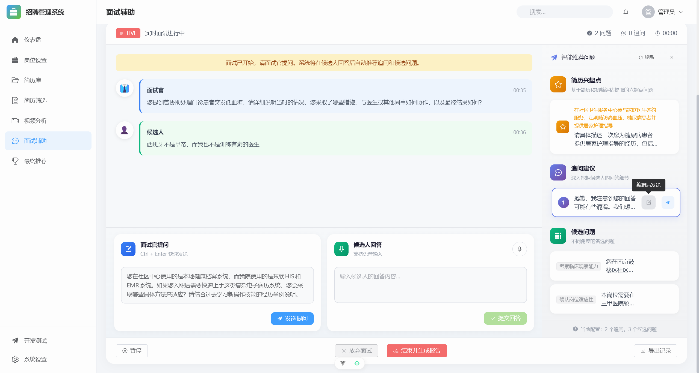
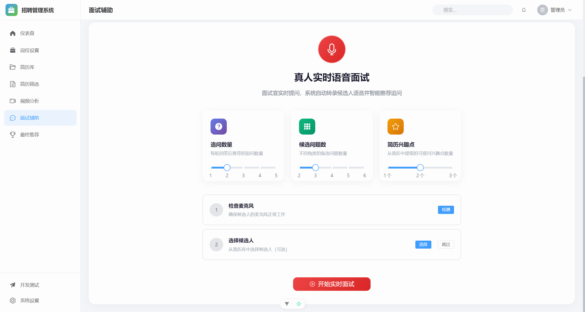
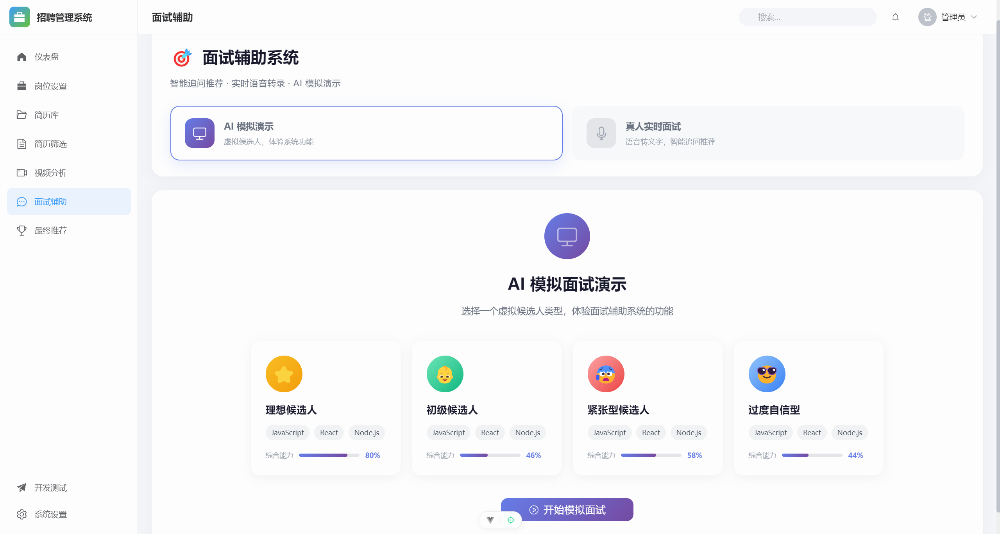
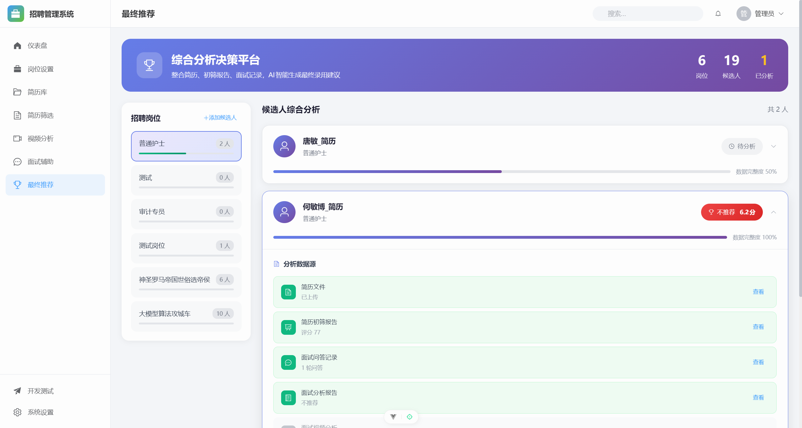

# HRM2 招聘管理系统前端（Vue 版）

本项目是 HRM2 招聘管理系统的前端界面，基于 **Vue 3 + Vite + TypeScript + Element Plus** 实现，主要用于配合后端（Django）完成招聘流程的可视化管理与操作。

## 技术栈

| 层级 | 技术 |
| ---- | ---- |
| 框架 | Vue 3.5 + Vue Router 4 + Pinia 3 |
| 构建 | Vite 7 + TypeScript 5 |
| UI 组件 | Element Plus 2.11 |
| 图表 | ECharts 6 |
| 文件解析 | pdfjs-dist（PDF）、mammoth（Word） |
| Markdown | marked + highlight.js |
| HTTP | axios |
| Node | ^20.19.0 \|\| >=22.12.0 |

## 快速开始

### 1. 安装依赖

```bash
npm install
```

### 2. 配置后端 API 地址

编辑 `vite.config.ts` 或创建 `.env.local` 文件：

```env
VITE_API_BASE=http://localhost:8000
```

### 3. 启动开发服务器

```bash
npm run dev
```

访问 `http://localhost:5173`

### 4. 构建生产版本

```bash
npm run build
npm run preview  # 预览构建结果
```

## 项目结构

```text
HRM2-Vue-Frontend_new/
  ├─ package.json            # 前端项目依赖与脚本
  ├─ vite.config.ts          # Vite 构建配置
  ├─ tsconfig*.json          # TypeScript 配置
  ├─ index.html              # 应用入口 HTML
  ├─ public/                 # 不经打包的静态资源
  └─ src/                    # 主要源代码目录
      ├─ main.ts             # Vue 应用入口，挂载 App.vue，注册路由、Pinia、Element Plus
      ├─ App.vue             # 根组件，承载主布局
      ├─ router/             # 前端路由配置（如仪表盘、岗位设置、简历库等）
      │   └─ index.ts
      ├─ api/                # 与后端交互的 API 封装
      │   ├─ index.ts         # API 方法实现（axios + fetch）
      │   └─ API_METHODS.md   # API 接口文档
      ├─ stores/             # Pinia 状态管理（全局状态、配置等）
      ├─ types/              # TypeScript 类型定义（岗位、简历、任务等业务类型）
      ├─ utils/              # 通用工具函数（预留/复用逻辑）
      ├─ assets/             # 全局样式与静态资源（如 main.css）
      ├─ components/         # 复用组件，按业务模块拆分
      │   ├─ layout/         # 布局相关组件（侧边栏、顶部栏、主布局）
      │   ├─ common/         # 通用组件（岗位列表等在多页复用的组件）
      │   ├─ positions/      # 岗位设置页相关组件
      │   ├─ library/        # 简历库相关组件（上传、详情对话框等）
      │   ├─ screening/      # 简历筛选流程组件（上传区、任务队列、历史任务等）
      │   ├─ video/          # 视频分析相关组件（候选人列表、上传对话框等）
      │   ├─ interview/      # 面试辅助组件（设置面板、问题建议、对话面板、AI 模拟等）
      │   ├─ recommend/      # 最终推荐结果展示与控制组件
      │   └─ dev-tools/      # 开发测试工具组件（如随机简历生成器）
      ├─ composables/        # 组合式函数（业务逻辑拆分）
      │   ├─ usePositionEditor.ts      # 岗位信息编辑与保存逻辑
      │   ├─ usePositionManagement.ts  # 岗位及岗位-简历关系管理
      │   ├─ useResumeLibrary.ts       # 简历库查询、分页、上传、删除等
      │   ├─ useResumeUpload.ts        # 筛选页上传文件与任务提交
      │   ├─ useHistoryTasks.ts        # 筛选任务历史查询与分页
      │   ├─ useTaskPolling.ts         # 筛选任务轮询与队列管理
      │   ├─ useVideoUpload.ts         # 视频文件上传逻辑
      │   ├─ useInterviewAssist.ts     # 面试辅助核心逻辑（会话、问题、问答、报告）
      │   ├─ useInterviewQuestions.ts  # 面试题生成、评分与报告导出
      │   ├─ useSpeechRecognition.ts   # 语音识别功能（Web Speech API）
      │   ├─ useRecommendAnalysis.ts   # 最终推荐分析任务管理与进度
      │   ├─ useResumeDetail.ts        # 简历详情预览、报告下载等
      │   ├─ useResumeAssignment.ts    # 简历与岗位分配/移除逻辑
      │   ├─ useScreeningUtils.ts      # 筛选流程相关通用工具
      │   ├─ useFileParser.ts          # 本地文件解析（PDF、Word、TXT）
      │   └─ useLibraryFileParser.ts   # 简历库中简历内容解析
      └─ views/             # 页面级组件，对应路由
          ├─ DashboardView.vue        # 仪表盘
          ├─ PositionsView.vue        # 岗位设置
          ├─ ResumeLibraryView.vue    # 简历库
          ├─ ScreeningView.vue        # 简历初筛系统
          ├─ VideoView.vue            # 视频分析页面
          ├─ InterviewView.vue        # 面试辅助页面
          ├─ RecommendView.vue        # 最终录用推荐页面
          ├─ DevToolsView.vue         # 开发测试工具页面
          ├─ SettingsView.vue         # 系统设置页面
          └─ HomeView.vue             # 预留/通用首页
```

## 功能概览

- **仪表盘**：
  - 展示整体招聘数据概况、最近筛选任务、岗位及候选人相关统计
  - 提供常用操作的快捷入口

- **岗位设置**：
  - 管理招聘岗位列表
  - 配置岗位的基础信息与筛选标准

- **简历库**：
  - 上传、管理候选人简历
  - 支持按关键字、筛选状态、分配状态等维度查询

- **简历筛选**：
  - 通过上传简历触发后端 AI 初筛任务
  - 查看任务处理队列与历史任务
  - 支持将简历分配到不同岗位

- **视频分析（功能待补全）**：
  - 规划用于上传候选人视频并进行 AI 分析
  - 当前页面结构和交互已搭建，部分后端分析逻辑仍在完善中

- **面试辅助系统**：
  - 支持创建面试会话，选择候选人简历
  - AI 自动生成问题池（含简历兴趣点分析）
  - 实时记录问答，生成候选提问建议
  - 支持语音识别输入（Web Speech API）
  - 生成面试最终报告（含维度分析、亮点、红旗等）
  - **真人实时面试模式**：面试官可实时记录问答
  - **AI 模拟面试模式**：AI 扮演候选人进行模拟面试练习

- **最终录用推荐系统**：
  - 汇总多维度评分结果（初筛、视频分析、面试等）综合给出录用建议
  - 支持单人综合分析，基于 Rubric 量表多维度评估
  - 查看候选人详细数据（简历、初筛报告、面试记录、面试报告）
  - 生成综合评估报告与录用建议

- **开发测试工具**：
  - 提供开发环境下的测试数据生成工具（如随机简历生成）
  - 仅建议在开发环境启用

- **系统设置**：
  - 配置后端 API 地址、超时时间等
  - 设置自动刷新、通知、语言等系统偏好
  - 提供数据导入导出、本地缓存清理等能力

## 界面截图

> 注：以下截图均位于当前项目的 `info_images` 目录下，可根据需要在文档或其他地方复用。

- **仪表盘**

  

- **岗位设置**

  

- **简历库**

  

- **简历筛选**

  

- **视频分析（功能待补全）**

  

- **面试辅助系统 - 内部提问界面**

  

- **面试辅助系统 - 真人实时面试**

  

- **面试辅助系统 - AI 模拟演示**

  

- **最终录用推荐系统**

  

- **开发测试工具**

  

---

## API 文档

前端 API 封装详见 [`src/api/API_METHODS.md`](./src/api/API_METHODS.md)，包含所有后端接口的路径、参数、返回值说明。

